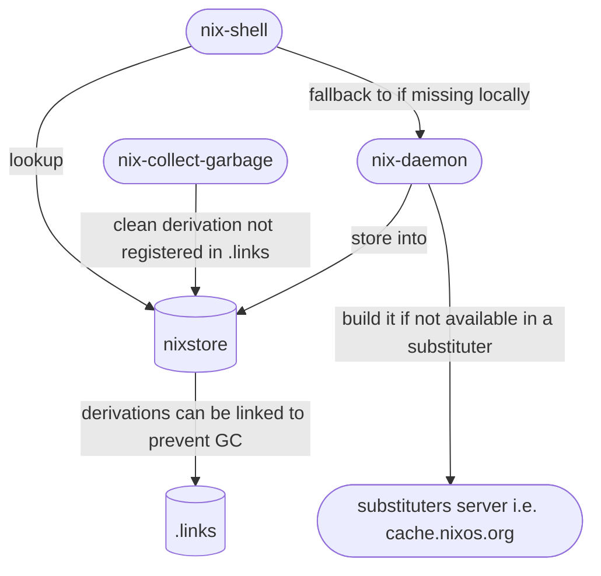
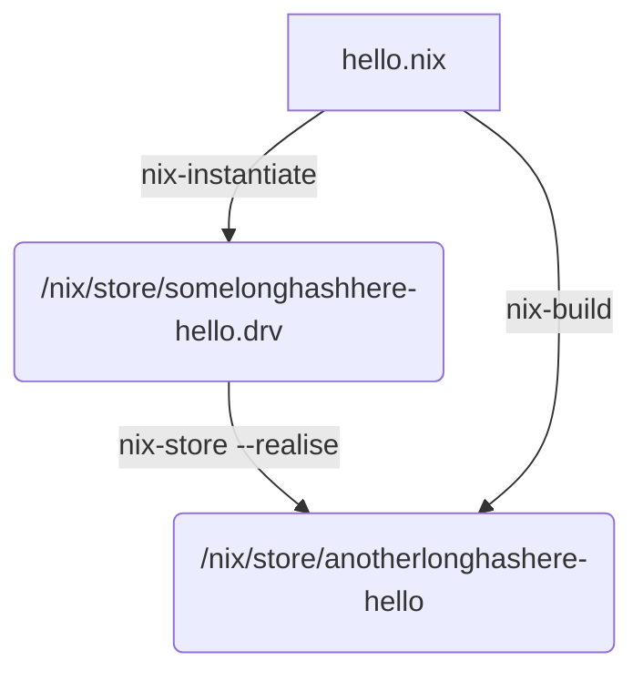

This section lists commands and options that you can use when you work
with Nix.

# Diagrams

## Store, substituters and garbage collector

This diagram explains what happens in the nix-store when you use nix-shell and when garbage collection happens.

## Nix-build

The following diagram explains how `nix-build` is a wrapper around `nix-instantiate` + `nix-store --realise`.

