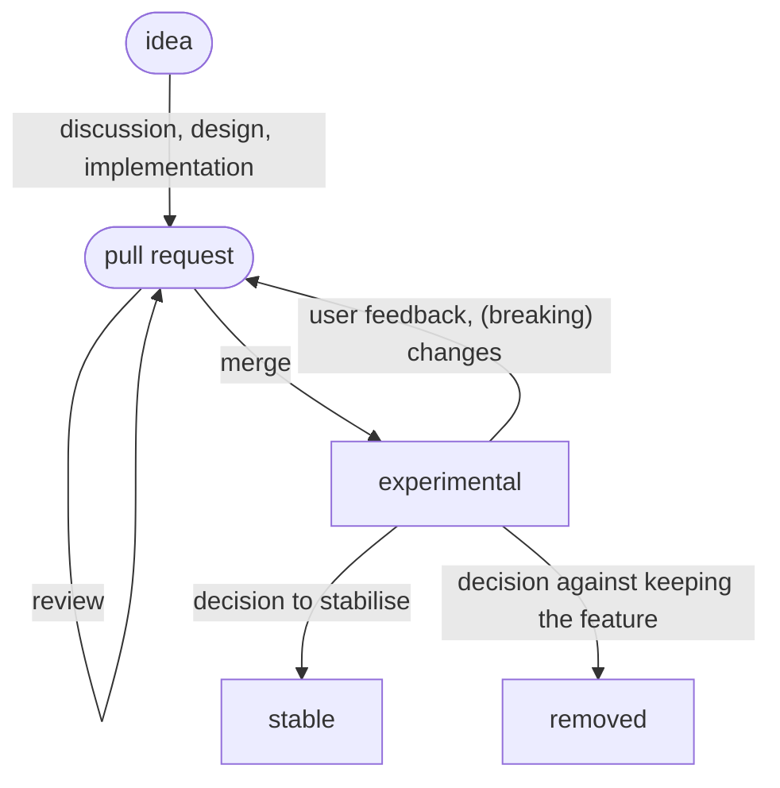

This section describes the notion of *experimental features*, and how it fits into the big picture of the development of Nix.

# What are experimental features?

Experimental features are new functionality that is not yet stable, but shipped as part of regular Nix releases to solicit community feedback.
Because the are not yet stable, experimental features can be changed or removed at any time.
Experimental features are guarded by named flags; users must [explicitly enable those flags](@docroot@/command-ref/conf-file.md#conf-experimental-features) those flags in order to use experimental features.
This allows users to try them out without unwittingly relying on them.

Experimental features were first introduced in [Nix 2.4](../release-notes/rl-2.4.md).

# When should a new feature be marked experimental?

Experimental features are needed for high stakes changes to Nix that benefit from broad community feedback.

Examples:

- Changes to the Nix language, such as new built-ins, syntactic or semantic changes, etc.
- Changes to the command-line interface

# Why are experimental features needed?

Most of the time, experimentation happens prior to merging PRs; Nix maintainers merge changes when we are confident in those changes.
Merging changes we are not confident in and then regretting those decisions leads to either:

- Breaking our stability guarantee
- Sticking with the wrong design

But for larger or highly visible changes, merging PRs only after we have become confident is not practical:

- The PR would have to be open for a very long period of time, burdening the PR author more than is practical
- We would still lack enough community input:
  regular community members can not be expected to install an unofficial version of Nix from a PR branch.

Experimental features are a middle ground which, via a little extra code, avoids all these bad outcomes:

# Lifecycle of an experimental feature

Experimental features have to be treated on a case-by-case basis.
However, the standard workflow for an experimental feature is as follows:

- A new feature is implemented in a *pull request*
  - It is guarded by an experimental feature flag that is disabled by default
- The pull request is merged, the *experimental* feature ends up in a release
    - Using the feature requires explicitly enabling it, signifying awareness of the potential risks
    - Being experimental, the feature can still be changed arbitrarily
- The feature can be *removed*
  - The associated experimental feature flag is also removed
- The feature can be *stabilised*
  - The associated experimental feature flag is removed
  - There should be enough evidence of users having tried the feature, such as feedback, fixed bugs, demonstrations of how it is put to use
  - Maintainers must feel confident that:
    - The feature is designed and implemented sensibly, that it is fit for purpose
    - Potential interactions are well-understood
    - Stabilising the feature will not incur an outsized maintenance burden in the future

The following diagram illustrates the process:

<!-- TODO: replace with ASCII art to render correctly once contents are agreed upon -->

# Relation to the RFC process

Experimental features and [RFCs](https://github.com/NixOS/rfcs/) both allow approaching substantial changes while minimizing the risk.
However they serve different purposes:

- An experimental feature enables developers to iterate on and deliver a new idea without committing to it or requiring a costly long-running fork.
  It is primarily an issue of *implementation*, targeting Nix developers and early testers.
- The goal of an RFC is to make explicit all the implications of a change:
  Explain why it is wanted, which new use-cases it enables, which interface changes it requires, etc.
  It is primarily an issue of *design* and *communication*, targeting the broader community.

This means that experimental features and RFCs are orthogonal mechanisms, and can be used independently or together as needed.
