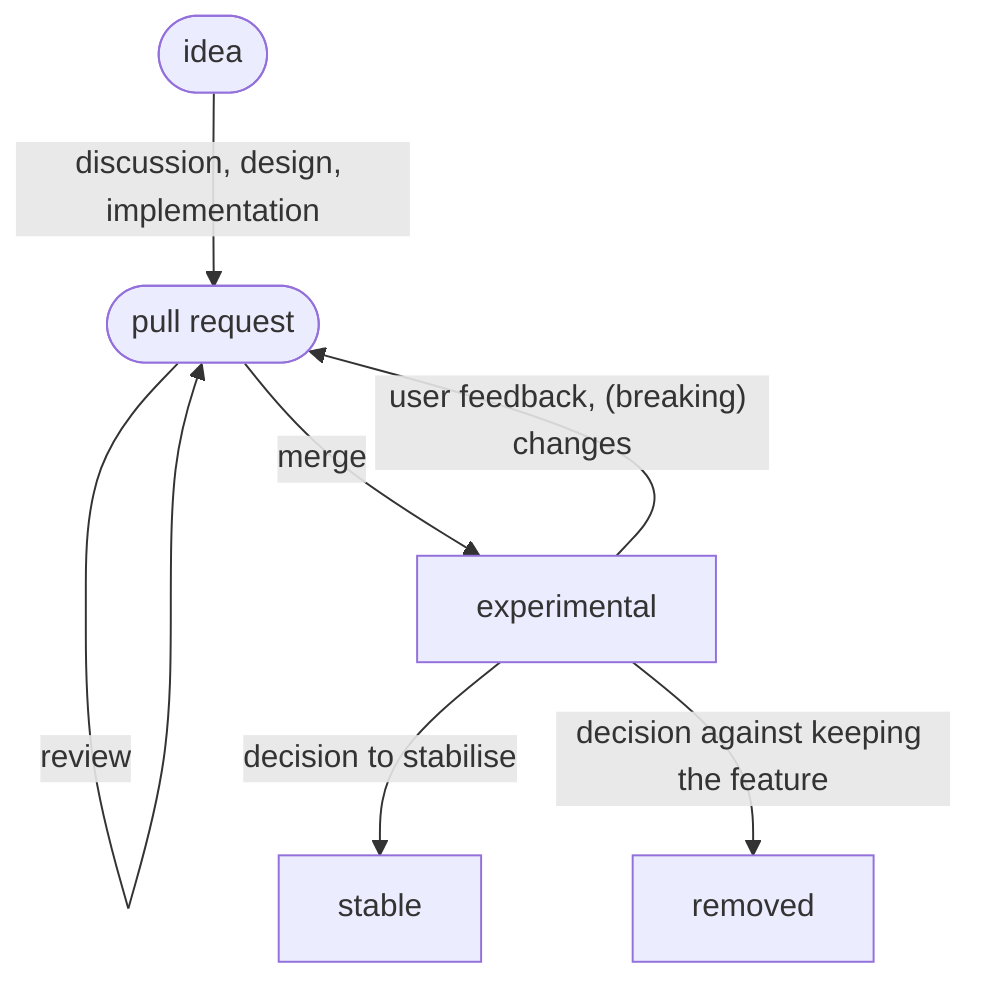

This section describes the notion of *experimental features*, and how it fits into the big picture of the development of Nix.

# What are experimental features?

[Since Nix 2.4](../release-notes/rl-2.4.md), some features of Nix can be flagged as experimental.
Experimental features can be changed or removed at any time, and users must [explicitly enable them](../nix-conf.md#conf-expeirmental-features).
This allows accessing new functionality that is not yet stable without unwittingly relying on them.

# When should a new feature be marked experimental?

A change in the Nix codebase should be guarded by an experimental feature flag if it is considered likely to be reverted or adapted in a backwards-incompatible manner after gathering more experience with it in practice.

Examples:

- Changes to the Nix language, such as new built-ins, syntactic or semantic changes, etc.
- Changes to the command-line interface

# Lifecycle of an experimental feature

Experimental features have to be treated on a case-by-case basis.
However, the standard workflow for an experimental feature is as follows:

- The feature is implemented in a pull request.
- The feature is guarded by an experimental feature flag that is disabled by default, and the pull request is merged.
    - Being experimental, the feature can still be changed arbitrarily or removed again.
- The experimental feature flag can be removed and the feature is considered stable if:
  - There is enough evidence of users having tried the feature, such as feedback, fixed bugs, demonstrations of how it is put to use
  - Maintainers feel confident that
    - The feature is designed and implemented sensibly, that it is fit for purpose
    - Potential interactions are well-understood
    - Stabilising the feature will not incur an outsized maintenance burden in the future

The following diagram illustrates the process:

<!-- TODO: replace with ASCII art to render correctly once contents are agreed upon -->

# Relation to the RFC process

Experimental features and [RFCs](https://github.com/NixOS/rfcs/) both allow approaching substantial changes while minimizing the risk.
However they serve different purposes:

- An experimental feature enables developers to iterate on and deliver a new idea without committing to it or requiring a costly long-running fork.
  It is primarily an issue of *implementation*, targeting Nix developers and early testers.
- The goal of an RFC is to make explicit all the implications of a change:
  Explain why it is wanted, which new use-cases it enables, which interface changes it requires, etc.
  It is primarily an issue of *design* and *communication*, targeting the broader community.

This means that experimental features and RFCs are orthogonal mechanisms, and can be used independently or together as needed.
