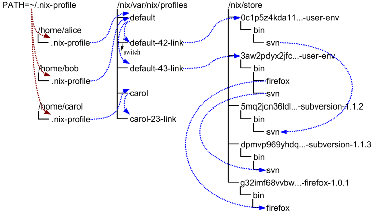

# Profiles

Profiles and user environments are Nix’s mechanism for implementing the
ability to allow different users to have different configurations, and
to do atomic upgrades and rollbacks. To understand how they work, it’s
useful to know a bit about how Nix works. In Nix, packages are stored in
unique locations in the *Nix store* (typically, `/nix/store`). For
instance, a particular version of the Subversion package might be stored
in a directory
`/nix/store/dpmvp969yhdqs7lm2r1a3gng7pyq6vy4-subversion-1.1.3/`, while
another version might be stored in
`/nix/store/5mq2jcn36ldlmh93yj1n8s9c95pj7c5s-subversion-1.1.2`. The long
strings prefixed to the directory names are cryptographic hashes (to be
precise, 160-bit truncations of SHA-256 hashes encoded in a base-32
notation) of *all* inputs involved in building the package — sources,
dependencies, compiler flags, and so on. So if two packages differ in
any way, they end up in different locations in the file system, so they
don’t interfere with each other. Here is what a part of a typical Nix
store looks like:



Of course, you wouldn’t want to type

```console
$ /nix/store/dpmvp969yhdq...-subversion-1.1.3/bin/svn
```

every time you want to run Subversion. Of course we could set up the
`PATH` environment variable to include the `bin` directory of every
package we want to use, but this is not very convenient since changing
`PATH` doesn’t take effect for already existing processes. The solution
Nix uses is to create directory trees of symlinks to *activated*
packages. These are called *user environments* and they are packages
themselves (though automatically generated by `nix-env`), so they too
reside in the Nix store. For instance, in the figure above, the user
environment `/nix/store/0c1p5z4kda11...-user-env` contains a symlink to
just Subversion 1.1.2 (arrows in the figure indicate symlinks). This
would be what we would obtain if we had done

```console
$ nix-env -i subversion
```

on a set of Nix expressions that contained Subversion 1.1.2.

This doesn’t in itself solve the problem, of course; you wouldn’t want
to type `/nix/store/0c1p5z4kda11...-user-env/bin/svn` either. That’s why
there are symlinks outside of the store that point to the user
environments in the store; for instance, the symlinks `default-42-link`
and `default-43-link` in the example. These are called *generations*
since every time you perform a `nix-env` operation, a new user
environment is generated based on the current one. For instance,
generation 43 was created from generation 42 when we did

```console
$ nix-env -i subversion firefox
```

on a set of Nix expressions that contained Firefox and a new version of
Subversion.

Generations are grouped together into *profiles* so that different users
don’t interfere with each other if they don’t want to. For example:

```console
$ ls -l /nix/var/nix/profiles/
...
lrwxrwxrwx  1 eelco ... default-42-link -> /nix/store/0c1p5z4kda11...-user-env
lrwxrwxrwx  1 eelco ... default-43-link -> /nix/store/3aw2pdyx2jfc...-user-env
lrwxrwxrwx  1 eelco ... default -> default-43-link
```

This shows a profile called `default`. The file `default` itself is
actually a symlink that points to the current generation. When we do a
`nix-env` operation, a new user environment and generation link are
created based on the current one, and finally the `default` symlink is
made to point at the new generation. This last step is atomic on Unix,
which explains how we can do atomic upgrades. (Note that the
building/installing of new packages doesn’t interfere in any way with
old packages, since they are stored in different locations in the Nix
store.)

If you find that you want to undo a `nix-env` operation, you can just do

```console
$ nix-env --rollback
```

which will just make the current generation link point at the previous
link. E.g., `default` would be made to point at `default-42-link`. You
can also switch to a specific generation:

```console
$ nix-env --switch-generation 43
```

which in this example would roll forward to generation 43 again. You can
also see all available generations:

```console
$ nix-env --list-generations
```

You generally wouldn’t have `/nix/var/nix/profiles/some-profile/bin` in
your `PATH`. Rather, there is a symlink `~/.nix-profile` that points to
your current profile. This means that you should put
`~/.nix-profile/bin` in your `PATH` (and indeed, that’s what the
initialisation script `/nix/etc/profile.d/nix.sh` does). This makes it
easier to switch to a different profile. You can do that using the
command `nix-env --switch-profile`:

```console
$ nix-env --switch-profile /nix/var/nix/profiles/my-profile

$ nix-env --switch-profile /nix/var/nix/profiles/default
```

These commands switch to the `my-profile` and default profile,
respectively. If the profile doesn’t exist, it will be created
automatically. You should be careful about storing a profile in another
location than the `profiles` directory, since otherwise it might not be
used as a root of the [garbage collector](garbage-collection.md).

All `nix-env` operations work on the profile pointed to by
`~/.nix-profile`, but you can override this using the `--profile` option
(abbreviation `-p`):

```console
$ nix-env -p /nix/var/nix/profiles/other-profile -i subversion
```

This will *not* change the `~/.nix-profile` symlink.
