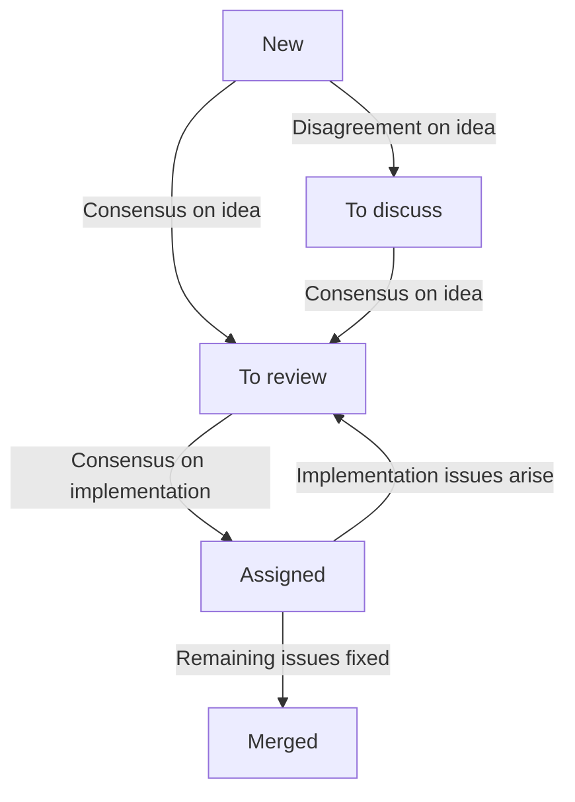

# Nix maintainers team

## Motivation

The goal of the team is to help other people to contribute to Nix.

## Members

- Eelco Dolstra (@edolstra) – Team lead
- Théophane Hufschmitt (@thufschmitt)
- Valentin Gagarin (@fricklerhandwerk)
- Thomas Bereknyei (@tomberek)
- Robert Hensing (@roberth)

## Meeting protocol

The team meets twice a week:

- Discussion meeting: [Fridays 13:00-14:00 CET](https://calendar.google.com/calendar/event?eid=MHNtOGVuNWtrZXNpZHR2bW1sM3QyN2ZjaGNfMjAyMjExMjVUMTIwMDAwWiBiOW81MmZvYnFqYWs4b3E4bGZraGczdDBxZ0Bn)

  1. Triage issues and pull requests from the _No Status_ column (30 min)
  2. Discuss issues and pull requests from the _To discuss_ column (30 min)

- Work meeting: [Mondays 13:00-15:00 CET](https://calendar.google.com/calendar/event?eid=NTM1MG1wNGJnOGpmOTZhYms3bTB1bnY5cWxfMjAyMjExMjFUMTIwMDAwWiBiOW81MmZvYnFqYWs4b3E4bGZraGczdDBxZ0Bn)

  1. Code review on pull requests from _In review_.
  2. Other chores and tasks.

Meeting notes are collected on a [collaborative scratchpad](https://pad.lassul.us/Cv7FpYx-Ri-4VjUykQOLAw), and published on Discourse under the [Nix category](https://discourse.nixos.org/c/dev/nix/50).

## Project board protocol

The team uses a [GitHub project board](https://github.com/orgs/NixOS/projects/19/views/1) for tracking its work.

Issues on the board progress through the following states:

- No Status

  Team members can add pull requests or issues to discuss or review together.

  During the discussion meeting, the team triages new items.
  If there is disagreement on the general idea behind an issue or pull request, it is moved to _To discuss_, otherwise to _In review_.

- To discuss

  Pull requests and issues that are important and controversial are discussed by the team during discussion meetings.

  This may be where the merit of the change itself or the implementation strategy is contested by a team member.

- In review

  Pull requests in this column are reviewed together during work meetings.
  This is both for spreading implementation knowledge and for establishing common values in code reviews.

  When the overall direction is agreed upon, even when further changes are required, the pull request is assigned to one team member.

- Assigned for merging

  One team member is assigned to each of these pull requests.
  They will communicate with the authors, and make the final approval once all remaining issues are addressed.

  If more substantive issues arise, the assignee can move the pull request back to _To discuss_ to involve the team again.

The process is illustrated in the following diagram:

