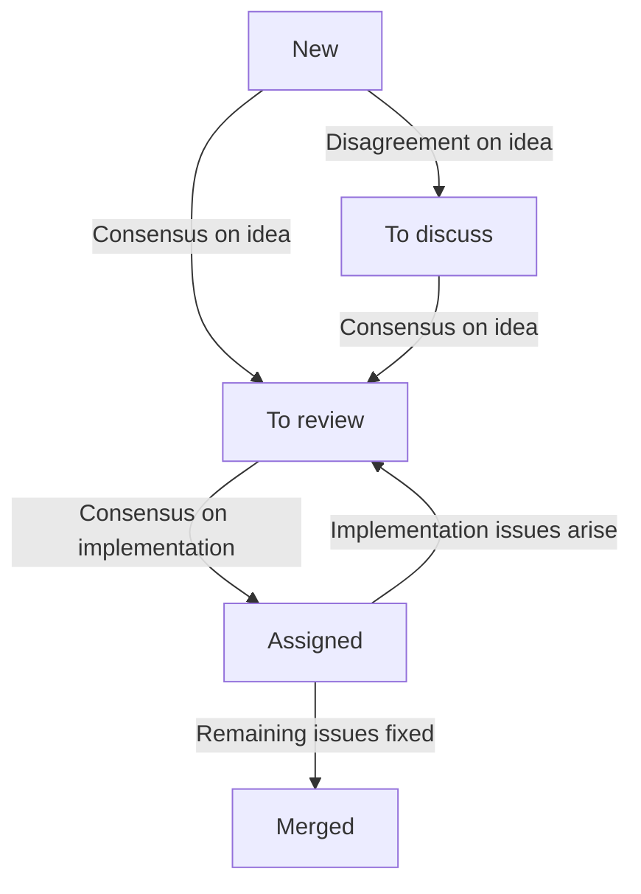

# Nix maintainers team

## Motivation

The team's main responsibility is to guide and direct the development of Nix and ensure that the code is in good shape.

We aim to achieve this by improving the contributor experience and attracting more maintainers – that is, by helping other people contributing to Nix and eventually taking responsibility – in order to scale the development process to match users' needs.

### Objectives

- It is obvious what is worthwhile to work on.
- It is easy to find the right place in the code to make a change.
- It is clear what is expected of a pull request.
- It is predictable how to get a change merged and released.

### Tasks

- Establish, communicate, and maintain a technical roadmap
- Improve documentation targeted at contributors
  - Record architecture and design decisions
  - Elaborate contribution guides and abide to them
  - Define and assert quality criteria for contributions
- Maintain the issue tracker and triage pull requests
- Help contributors succeed with pull requests that address roadmap milestones
- Manage the release lifecycle
- Regularly publish reports on work done
- Engage with third parties in the interest of the project
- Ensure the required maintainer capacity for all of the above

## Members

See https://nixos.org/community/teams/nix/ for the current team membership.

The team is on Github as [@NixOS/nix-team](https://github.com/orgs/NixOS/teams/nix-team).

## Meeting protocol

The team meets twice a week (times are denoted in the [Europe/Amsterdam](https://en.m.wikipedia.org/wiki/Time_in_the_Netherlands) time zone):

- Discussion meeting: Wednesday 21:00-22:00 Europe/Amsterdam see [calendar](https://calendar.google.com/calendar/u/0/embed?src=b9o52fobqjak8oq8lfkhg3t0qg@group.calendar.google.com).

  1. Triage issues and pull requests from the [No Status](#no-status) column (30 min)
  2. Discuss issues and pull requests from the [To discuss](#to-discuss) column (30 min).
     Once a month, each team member checks the [Assigned](#assigned) column for prs/issues assigned to them, to either
       - unblock it by providing input
       - mark it as draft if it is blocked on the contributor
       - escalate it back to the team by moving it to To discuss, and leaving a comment as to why the issue needs to be discussed again.

- Work meeting: Mondays 18:00-20:00 Europe/Amsterdam; see [calendar](https://calendar.google.com/calendar/u/0/embed?src=b9o52fobqjak8oq8lfkhg3t0qg@group.calendar.google.com).

  1. Code review on pull requests from [In review](#in-review).
  2. Other chores and tasks.

Meeting notes are collected on a [collaborative scratchpad](https://pad.lassul.us/Cv7FpYx-Ri-4VjUykQOLAw).
Notes on issues and pull requests are posted as comments and linked from the meeting notes, so they are can be found from both places.
[All meeting notes](https://discourse.nixos.org/search?expanded=true&q=Nix%20team%20meeting%20minutes%20%23%20%23dev%3Anix%20in%3Atitle%20order%3Alatest_topic) are published on Discourse under the [Nix category](https://discourse.nixos.org/c/dev/nix/50).

Team meetings are generally open to anyone interested.
We can make exceptions to discuss sensitive issues, such as security incidents or people matters.
Contact any team member to get a calendar invite for reminders and updates.

> [!IMPORTANT]
> [Handling security reports](./security-reports.md) always takes priority.

## Project board protocol

The team uses a [GitHub project board](https://github.com/orgs/NixOS/projects/19/views/1) for tracking its work.

Items on the board progress through the following states:

### No Status

During the discussion meeting, the team triages new items.
To be considered, issues and pull requests must have a high-level description to provide the whole team with the necessary context at a glance.

On every meeting, at least one item from each of the following categories is inspected:

1. [critical](https://github.com/NixOS/nix/labels/critical)
2. [security](https://github.com/NixOS/nix/labels/security)
3. [regression](https://github.com/NixOS/nix/labels/regression)
4. [bug](https://github.com/NixOS/nix/issues?q=is%3Aopen+label%3Abug+sort%3Areactions-%2B1-desc)
5. [tests of existing functionality](https://github.com/NixOS/nix/issues?q=is%3Aopen+label%3Atests+-label%3Afeature+sort%3Areactions-%2B1-desc)

- [oldest pull requests](https://github.com/NixOS/nix/pulls?q=is%3Apr+is%3Aopen+sort%3Acreated-asc)
- [most popular pull requests](https://github.com/NixOS/nix/pulls?q=is%3Apr+is%3Aopen+sort%3Areactions-%2B1-desc)
- [oldest issues](https://github.com/NixOS/nix/issues?q=is%3Aissue+is%3Aopen+sort%3Acreated-asc)
- [most popular issues](https://github.com/NixOS/nix/issues?q=is%3Aissue+is%3Aopen+sort%3Areactions-%2B1-desc)

Team members can also add pull requests or issues they would like the whole team to consider.
To ensure process quality and reliability, all non-trivial pull requests must be triaged before merging.

If there is disagreement on the general idea behind an issue or pull request, it is moved to [To discuss](#to-discuss).
Otherwise, the issue or pull request in questions get the label [`idea approved`](https://github.com/NixOS/nix/labels/idea%20approved).
For issues this means that an implementation is welcome and will be prioritised for review.
For pull requests this means that:
- Unfinished work is encouraged to be continued.
- A reviewer is assigned to take responsibility for getting the pull request merged.
  The item is moved to the [Assigned](#assigned) column.
- If needed, the team can decide to do a collarorative review.
  Then the item is moved to the [In review](#in-review) column, and review session is scheduled.

What constitutes a trivial pull request is up to maintainers' judgement.

### To discuss

Pull requests and issues that are deemed important and controversial are discussed by the team during discussion meetings.

This may be where the merit of the change itself or the implementation strategy is contested by a team member.
Whenever the discussion opens up questions about the process or this team's goals, this may indicate that the change is too large in scope.
In that case it is taken off the board to be reconsidered by the author or broken down into smaller pieces that are less far-reaching and can be reviewed independently.

As a general guideline, the order of items to discuss is determined as follows:

- Prioritise pull requests over issues

  Contributors who took the time to implement concrete change proposals should not wait indefinitely.

- Prioritise fixing bugs and testing over documentation, improvements or new features

  The team values stability and accessibility higher than raw functionality.

- Interleave issues and PRs

  This way issues without attempts at a solution get a chance to get addressed.

### In review

Pull requests in this column are reviewed together during work meetings.
This is both for spreading implementation knowledge and for establishing common values in code reviews.

When the overall direction is agreed upon, even when further changes are required, the pull request is assigned to one team member.
If significant changes are requested or reviewers cannot come to a conclusion in reasonable time, the pull request is [marked as draft](https://docs.github.com/en/pull-requests/collaborating-with-pull-requests/proposing-changes-to-your-work-with-pull-requests/changing-the-stage-of-a-pull-request#converting-a-pull-request-to-a-draft).

### Assigned

One team member is assigned to each of these pull requests.
They will communicate with the authors, and make the final approval once all remaining issues are addressed.

If more substantive issues arise, the assignee can move the pull request back to [To discuss](#to-discuss) or [In review](#in-review) to involve the team again.

### Flowchart

The process is illustrated in the following diagram:

