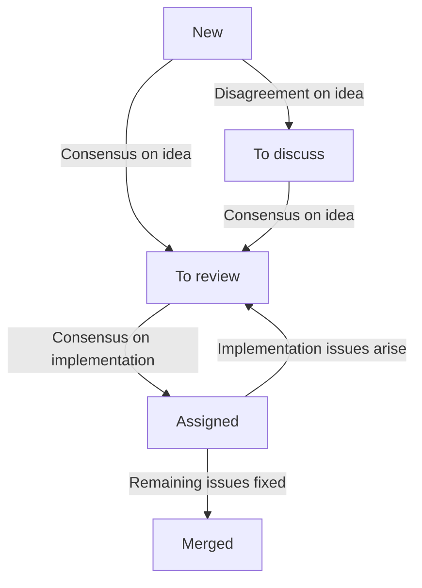

# Nix maintainers team

## Motivation

The team's main responsibility is to set a direction for the development of Nix and ensure that the code is in good shape.

We aim to achieve this by improving the contributor experience and attracting more maintainers – that is, by helping other people contributing to Nix and eventually taking responsibility – in order to scale the development process to match users' needs.

### Objectives

- It is obvious what is worthwhile to work on.
- It is easy to find the right place in the code to make a change.
- It is clear what is expected of a pull request.
- It is predictable how to get a change merged and released.

### Tasks

- Establish, communicate, and maintain a technical roadmap
- Improve documentation targeted at contributors
  - Record architecture and design decisions
  - Elaborate contribution guides and abide to them
  - Define and assert quality criteria for contributions
- Maintain the issue tracker and triage pull requests
- Help contributors succeed with pull requests that address roadmap milestones
- Manage the release lifecycle
- Regularly publish reports on work done
- Engage with third parties in the interest of the project
- Ensure the required maintainer capacity for all of the above

## Members

- Eelco Dolstra (@edolstra) – Team lead
- Théophane Hufschmitt (@thufschmitt)
- Valentin Gagarin (@fricklerhandwerk)
- Thomas Bereknyei (@tomberek)
- Robert Hensing (@roberth)
- John Ericson (@Ericson2314)

## Meeting protocol

The team meets twice a week:

- Discussion meeting: [Fridays 13:00-14:00 CET](https://calendar.google.com/calendar/event?eid=MHNtOGVuNWtrZXNpZHR2bW1sM3QyN2ZjaGNfMjAyMjExMjVUMTIwMDAwWiBiOW81MmZvYnFqYWs4b3E4bGZraGczdDBxZ0Bn)

  1. Triage issues and pull requests from the _No Status_ column (30 min)
  2. Discuss issues and pull requests from the _To discuss_ column (30 min)

- Work meeting: [Mondays 13:00-15:00 CET](https://calendar.google.com/calendar/event?eid=NTM1MG1wNGJnOGpmOTZhYms3bTB1bnY5cWxfMjAyMjExMjFUMTIwMDAwWiBiOW81MmZvYnFqYWs4b3E4bGZraGczdDBxZ0Bn)

  1. Code review on pull requests from _In review_.
  2. Other chores and tasks.

Meeting notes are collected on a [collaborative scratchpad](https://pad.lassul.us/Cv7FpYx-Ri-4VjUykQOLAw), and published on Discourse under the [Nix category](https://discourse.nixos.org/c/dev/nix/50).

## Project board protocol

The team uses a [GitHub project board](https://github.com/orgs/NixOS/projects/19/views/1) for tracking its work.

Items on the board progress through the following states:

- No Status

  During the discussion meeting, the team triages new items.
  To be considered, issues and pull requests must have a high-level description to provide the whole team with the necessary context at a glance.

  On every meeting, at least one item from each of the following categories is inspected:

  1. [critical](https://github.com/NixOS/nix/labels/critical)
  2. [security](https://github.com/NixOS/nix/labels/security)
  3. [regression](https://github.com/NixOS/nix/labels/regression)
  4. [bug](https://github.com/NixOS/nix/issues?q=is%3Aopen+label%3Abug+sort%3Areactions-%2B1-desc)
  5. [tests of existing functionality](https://github.com/NixOS/nix/issues?q=is%3Aopen+label%3Atests+-label%3Afeature+sort%3Areactions-%2B1-desc)

  - [oldest pull requests](https://github.com/NixOS/nix/pulls?q=is%3Apr+is%3Aopen+sort%3Acreated-asc)
  - [most popular pull requests](https://github.com/NixOS/nix/pulls?q=is%3Apr+is%3Aopen+sort%3Areactions-%2B1-desc)
  - [oldest issues](https://github.com/NixOS/nix/issues?q=is%3Aissue+is%3Aopen+sort%3Acreated-asc)
  - [most popular issues](https://github.com/NixOS/nix/issues?q=is%3Aissue+is%3Aopen+sort%3Areactions-%2B1-desc)

  Team members can also add pull requests or issues they would like the whole team to consider.
  To ensure process quality and reliability, all non-trivial pull requests must be triaged before merging.

  If there is disagreement on the general idea behind an issue or pull request, it is moved to _To discuss_.
  Otherwise, the issue or pull request in questions get the label [`idea approved`](https://github.com/NixOS/nix/labels/idea%20approved).
  For issues this means that an implementation is welcome and will be prioritised for review.
  For pull requests this means that:
  - Unfinished work is encouraged to be continued.
  - A reviewer is assigned to take responsibility for getting the pull request merged.
    The item is moved to the _Assigned_ column.
  - If needed, the team can decide to do a collarorative review.
    Then the item is moved to the _In review_ column, and review session is scheduled.

  What constitutes a trivial pull request is up to maintainers' judgement.

- To discuss

  Pull requests and issues that are deemed important and controversial are discussed by the team during discussion meetings.

  This may be where the merit of the change itself or the implementation strategy is contested by a team member.

  As a general guideline, the order of items is determined as follows:

  - Prioritise pull requests over issues

    Contributors who took the time to implement concrete change proposals should not wait indefinitely.

  - Prioritise fixing bugs and testing over documentation, improvements or new features

    The team values stability and accessibility higher than raw functionality.

  - Interleave issues and PRs

    This way issues without attempts at a solution get a chance to get addressed.

- In review

  Pull requests in this column are reviewed together during work meetings.
  This is both for spreading implementation knowledge and for establishing common values in code reviews.

  When the overall direction is agreed upon, even when further changes are required, the pull request is assigned to one team member.

- Assigned

  One team member is assigned to each of these pull requests.
  They will communicate with the authors, and make the final approval once all remaining issues are addressed.

  If more substantive issues arise, the assignee can move the pull request back to _To discuss_ or _In review_ to involve the team again.

The process is illustrated in the following diagram:

